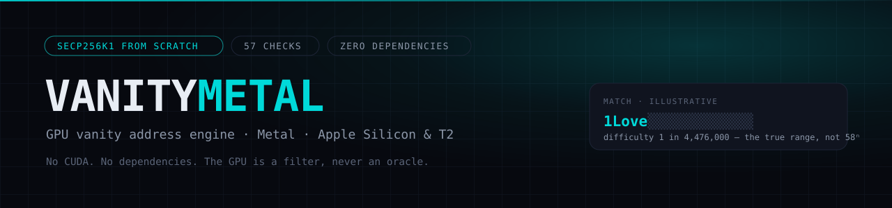
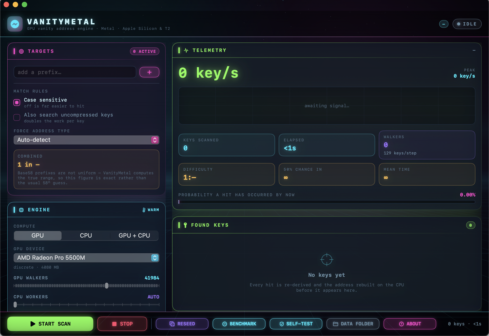

<p>


<a href="https://github.com/Solitechworld/VanityMetal/actions/workflows/ci.yml"></a>
</p>

**[Documentation site](https://solitechworld.github.io/VanityMetal/)** · [Install](docs/00-INSTALL.md) · [Architecture](docs/01-ARCHITECTURE.md) · [Verification](docs/04-VERIFICATION.md)

A GPU vanity-address engine for the Mac, written from scratch in Swift and
Metal. Where [VanitySearch](https://github.com/JeanLucPons/VanitySearch) needs
CUDA and an NVIDIA card, VanityMetal runs the same class of search on Apple's
own GPU stack — Apple silicon (M-series) and the Intel Iris / AMD Radeon GPUs
found in T2 Macs.

**Standalone by design.** One `swift build`, one `.app`. No CUDA, no Homebrew,
no Python at runtime, no third-party Swift packages, no shell scripts to babysit.
The Metal kernels are embedded in the binary and compiled at launch.



*Idle, on a 16-inch MacBook Pro with an AMD Radeon Pro 5500M. The difficulty
card explains itself: Base58 prefixes are not uniform, so the figure shown is
the true one rather than the usual 58ⁿ guess. The note under Found Keys is the
guarantee the whole design rests on — every hit is re-derived and the address
rebuilt on the CPU before it appears.*

---

## Requirements

| | Needed for | Notes |
|---|---|---|
| **macOS 12 (Monterey) or newer** | everything | `build.sh` refuses anything older |
| **Xcode Command Line Tools** | building | `xcode-select --install` · ~2 GB |
| **Swift 5.7+** | building | Ships with Command Line Tools 14+ / Xcode 14+ |
| **~600 MB free disk** | building | `.build` reaches ~578 MB; the app itself is 3 MB |
| **A Metal-capable GPU** | the fast path | Optional — the CPU engine runs without one |
| **Full Xcode** | `swift test` only | **Not required.** `./build.sh --test` covers the same ground |

No Homebrew, no CUDA, no package manager, no Swift dependencies. Apple silicon
and the Intel Iris / AMD Radeon GPUs in T2 Macs are both supported.

---

## Install

There is no prebuilt download. You build it yourself, which is the point for a
program that generates private keys.

```bash
xcode-select --install                                        # if you haven't
git clone https://github.com/Solitechworld/VanityMetal.git
cd VanityMetal
./build.sh --test                                             # build + verify
open VanityMetal.app
```

`./build.sh` checks your toolchain, compiles in release mode, assembles the app
bundle, builds the icon with `iconutil` and ad-hoc signs it so Gatekeeper does
not nag. Drop the result anywhere — `/Applications`, or leave it where it is.
First build takes 2–5 minutes.

**The first launch is slow and that is normal.** The Metal kernels compile from
embedded source at startup: about 5 s on Apple silicon, and measured at 23 s on
an AMD Radeon Pro 5500M. It is compiling, not hung, and the result is cached.

Full walkthrough — Gatekeeper, verification, updating, and how to uninstall
**without destroying keys you have found** — in **`docs/00-INSTALL.md`**.

---

## What it does

| | |
|---|---|
| **Bitcoin P2PKH** | `1…` — compressed and, optionally, uncompressed keys |
| **Bitcoin P2SH-P2WPKH** | `3…` |
| **Bitcoin Bech32 SegWit v0** | `bc1q…` (and `tb1q…` for testnet) |
| **Ethereum** | `0x…`, with EIP-55 checksummed output |

Type a prefix and the app works out which kind it is. Several prefixes can be
hunted at once, and the combined difficulty updates as you type.

Everything else lives in the control panel: GPU device picker, walker count,
CPU worker count, steps per dispatch, case sensitivity, uncompressed-key
search, thermal guard, stop-on-first-hit, auto-save, a live hashrate trace, a
probability meter, an on-demand benchmark, an on-demand GPU self-test, and a
backdrop you can dial down or switch off when you would rather spend the
cycles on the search.

---

## How the search works

Each GPU thread holds a point on secp256k1 and walks it forward through the key
space. Naively, generating the next public key means one modular inversion —
the single most expensive operation in the whole pipeline, roughly 270
multiplications.

Instead, every thread generates **129 public keys per step**: the centre point,
plus 64 on each side, obtained by adding ±1G … ±64G. Points at `+iG` and `-iG`
share the same *x* coordinate, so they share a denominator, and a Montgomery
batch inversion turns 65 inversions into one inversion and a chain of
multiplications. The 130th slot in the batch carries the jump to the next
centre, so the walk advances by exactly 129 keys with no extra inverse.

All of it runs on the GPU: 256-bit field arithmetic on eight 32-bit limbs
(chosen so the code behaves identically on Apple silicon and on the older Intel
and AMD GPUs in T2 Macs), the curve arithmetic, SHA-256, RIPEMD-160 and
Keccak-256. The CPU only wakes up for hits.

### The GPU is a filter, never an oracle

Every hit the GPU reports is re-derived on the CPU from the private key, the
address is rebuilt from scratch, and the prefix is string-compared before
anything reaches the screen. A numerical bug in the shader could cost
throughput; it cannot hand you a key that does not work.

On top of that, the shader carries known-answer tests for field addition, the
modular-inverse addition chain, SHA-256, RIPEMD-160 and Keccak-256. They run on
the GPU at launch, and if the GPU disagrees with the reference values the app
says so and falls back to the multi-core CPU engine automatically.

---

## Why the difficulty number looks different

Most vanity tools quote **58ⁿ** for an *n*-character Base58 prefix. That figure
is wrong, and usually pessimistic.

A Bitcoin address is Base58Check over a 25-byte payload, and Base58 digits do
not line up with the 160-bit hash. The consequence is that the leading
characters of an address are **not uniformly distributed** — about 97% of P2PKH
addresses have a second character drawn from only the first 24 Base58 digits.

VanityMetal converts a prefix into exact inclusive **ranges** over the 20-byte
hash — sometimes more than one, because an address can be 33 or 34 characters
long — and the GPU does a range comparison rather than a bit-mask test. So the
difficulty shown is the real one:

| prefix | naive 58ⁿ | actual |
|---|---|---|
| `1A` | 58 | **22.9** |
| `1Love` | 11,320,000 | **4,476,000** |
| `3Cy` | 3,364 | **1,354** |
| `bc1qne0n` | — | **1,048,576** (exactly 32⁴) |
| `0xdecaf` | — | **1,048,576** (exactly 16⁵) |

The bit-aligned formats come out as clean powers, which is a good sign the
range maths is right. The Base58 numbers were verified empirically against
400,000 random hashes; predicted and observed hit rates agree within Poisson
noise (`Tools/verify_targets.py`).

---

## Verification

The maths was not written and hoped for. Three independent layers check it:

1. **`Tools/verify_model.py`** re-implements the Metal kernel limb-for-limb in
   Python and checks it against Python's own big integers, `hashlib`, and
   published test vectors — including the batch-inversion walk, where all 387
   keys generated over three batches are confirmed to equal *k·G*.
2. **`Tools/verify_targets.py`** checks the prefix parser in both directions:
   every address falls inside the ranges built from its own prefix, and every
   hash inside a range really does produce that prefix.
3. **`swift test`** covers the shipping Swift: field arithmetic, the comb
   ladder against a plain double-and-add reference, hash vectors, known
   addresses and WIF for a fixed key, the target parser, and an end-to-end run
   of the CPU engine that confirms the walk covers a contiguous block of keys
   with no gaps and no repeats.

```bash
python3 Tools/verify_model.py
python3 Tools/verify_targets.py
swift test
```

---

## Layout

```
Package.swift                     SwiftPM manifest — no dependencies
build.sh                          builds VanityMetal.app
Kernels/VanityKernels.metal       the GPU source of truth
Sources/VanityMetalCore/
    Secp256k1.swift               U256, field & scalar arithmetic, curve, comb ladder
    Hashing.swift                 SHA-256 (CryptoKit), RIPEMD-160, Keccak-256
    Encoding.swift                Base58Check, Bech32, WIF, EIP-55
    AddressTarget.swift           prefix → exact hash ranges + true difficulty
    MetalEngine.swift             device management, buffers, dispatch, self-test
    CPUEngine.swift               same algorithm on CPU cores (fallback / quiet mode)
    SearchController.swift        run loop, verification, statistics
    Persistence.swift             crash-safe result storage and export
    MetalShaderSource.swift       generated — embeds the .metal file
Sources/VanityMetalApp/           SwiftUI interface
Tools/                            verification models, icon generator, embed script
Tests/                            swift test suite
```

Editing the kernel means editing `Kernels/VanityKernels.metal` and then running
`Tools/embed_kernels.sh` to regenerate the embedded copy.

---

## Tuning

- **Walkers** — leave on `AUTO` first. More walkers means more parallelism but
  more per-thread private memory; the sweet spot on Apple silicon is usually a
  few thousand.
- **Steps per dispatch** — `AUTO-TUNE` targets a quarter-second per dispatch,
  which keeps the interface responsive. Raise it manually for a few percent
  more throughput at the cost of a laggier UI.
- **Thermal guard** — on by default. On a fanless MacBook it eases off when the
  system reports thermal pressure, which is usually *faster* over an hour than
  letting the machine throttle itself.
- **Backdrop** — the animated background costs a little GPU. Turn it off in the
  Visuals card for a pure-search machine.

---

## Keeping the keys safe

Anything this app finds is a real private key.

- Found keys are written to `~/Library/Application Support/VanityMetal/` with
  owner-only (`0600`) permissions, the moment they are verified, so a crash
  cannot lose one.
- Private material is masked in the interface until you press **REVEAL**.
- Exports (text, CSV or JSON) are written `0600` too.
- Every start-up draws a fresh 256-bit random base key from the system CSPRNG,
  and each walker is spaced 2¹²⁸ keys apart, so two walkers can never collide
  and no run repeats a previous one.

A vanity address is exactly as secure as any other address **provided you
generated it yourself and control the key**. Never accept a vanity private key
from someone else, and never paste a private key into a website to "check" it.
Move funds to a newly generated vanity address only once you are satisfied with
how you are storing its key.

---

## Documentation

| | |
|---|---|
| `docs/00-INSTALL.md` | Requirements, install, Gatekeeper, updating, safe uninstall |
| `docs/01-ARCHITECTURE.md` | The modules, the dispatch loop, and why there are two engines |
| `docs/02-GPU-KERNEL.md` | The Metal kernel: limbs, batch inversion, buffer layout, editing it |
| `docs/03-ADDRESS-MATH.md` | Why 58ⁿ is wrong, what is computed instead, how that was checked |
| `docs/04-VERIFICATION.md` | The four layers, what each covers, and what CI cannot cover |
| `docs/05-SECURITY.md` | Key handling, the supply chain, and what this does *not* protect against |
| `docs/06-BUILD-AND-RUN.md` | Running it, tuning walkers and dispatch, thermal behaviour |
| `CONTRIBUTING.md` | The two rules, paired constants, adding an address kind |

---

## Funding

VanityMetal is free and MIT licensed, and it stays that way. Donations are not
for this tool — they go to a separate project I am building, unreleased and not
yet public, aimed squarely at Bitcoin. I think it changes something real about
how people use it. That is my conviction and my bet to make, not a claim you
should take on trust; judge it when there is something to judge.

What you can judge today is this repository: a from-scratch secp256k1
implementation in Swift and Metal, four independent layers of verification, and
zero dependencies. If that is the standard of work you want funded, the address
is below.

```
bitcoin:1Be6LLAEndprdWKiH6YM62setFQRXJzfha
```

`1Be6LLAEndprdWKiH6YM62setFQRXJzfha` — mainnet P2PKH.

**Verify before you send.** A repository whose entire subject is generating
Bitcoin addresses is an unusually attractive place for someone to quietly swap
a donation address — in a fork, or in a pull request nobody reads closely.
Before sending anything you would mind losing, open an issue and ask me to
confirm the address, and compare the first and last four characters
(`1Be6` … `zfha`) against the reply. One independent confirmation is the
minimum, and that is worth doing on every project that asks for coins in a
text file, not only this one.

Nothing here is an investment offer, a security, or a claim on anything. No
return of any kind is implied or promised. For sponsorship or contract work,
open an issue.

---

## Licence

MIT — see `LICENSE`.

---

## Credit

The batch-inversion group-generation strategy is the one popularised by Jean-Luc
Pons' VanitySearch; the modular-inverse addition chain is the one from
libsecp256k1. Everything here — the Metal kernels, the Swift core, the range
based prefix maths and the interface — is an independent implementation.
